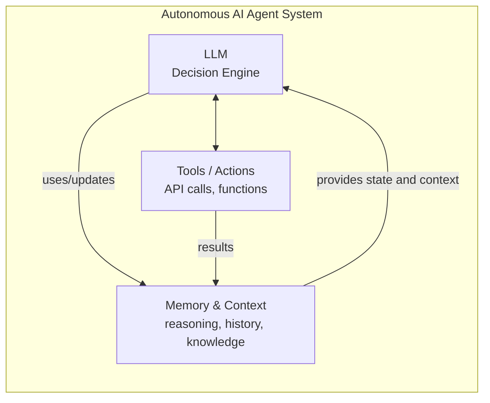
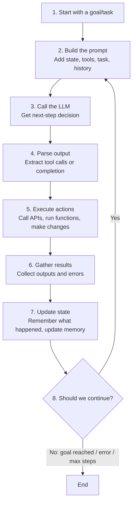

# Building Autonomous AI Agents: A Comprehensive Primer

## Introduction

When you hear about AI agents doing autonomous work—making API calls, retrieving data, making decisions, and executing complex workflows—you're likely hearing about a fascinating but often misunderstood technology. The core confusion typically stems from a simple question: *if AI systems like large language models (LLMs) are trained to generate text, how do they become agents that actually do things?*

The answer is elegantly simple: **LLMs don't become agents by themselves. Instead, they become the reasoning engine inside a larger system that combines their decision-making capabilities with tools, memory, and structured processes.** This primer explains how that system works, why it's powerful, and what you need to understand to build one.

If you're coming from a software engineering background, a useful mental model is this: an agent is just a program with an LLM in the decision loop. If you're coming from product or operations, think of it as a very capable junior operator that can read instructions, use software tools, and report what it did.

We'll keep this practical and conversational. The goal here is not to bury you in buzzwords. The goal is to help you build something that still works when inputs are messy, APIs are flaky, and users are unpredictable.

---

## Part 1: Fundamentals

### What Is an Autonomous AI Agent?

An autonomous AI agent is a software system that:

1. **Perceives** its environment (accepts input, reads data, monitors state)
2. **Reasons** about what to do next (using an LLM)
3. **Acts** to accomplish goals (calls APIs, executes functions, makes changes)
4. **Learns** from feedback and iterates

The crucial distinction: An agent is not just an LLM chatbot. A chatbot waits for human input and generates text in response. An **agent takes initiative**—it decides what actions to take without waiting for the human to specify every step.

A quick litmus test: if the system can only respond with text, it's a chat assistant. If it can choose and execute actions toward a goal, it's agentic.

### The Core Components

Every autonomous AI agent has these essential parts:



**1. The LLM (Large Language Model)**
The "brain" of your agent. Models like Claude, GPT-4, Llama, etc. are exceptionally good at understanding complex instructions and generating structured reasoning. They consume input text and produce output—including decisions about what actions to take.

**2. Tools / Actions**
These are the agent's hands. Tools are functions the agent can call: making HTTP requests, querying databases, reading files, sending emails, etc. The agent decides *which* tools to use based on its reasoning.

**3. Memory & Context**
The agent needs to maintain state: conversation history, facts about the current task, previous decisions, learned information. This prevents the agent from forgetting what it's done and why, and helps it make coherent decisions.

**4. Execution Loop**
The orchestration layer that repeatedly: asks the LLM what to do next → executes that action → feeds results back to the LLM → repeats until the goal is achieved or a stopping condition is met.

Mini example: an IT access agent receives "Grant dashboard access." It checks user identity, checks role policy, files an access request, and sends a confirmation. That simple loop is already a complete autonomous workflow.

---

## Part 2: How LLMs Enable Autonomous Behavior

### The Misconception: LLMs as Black Boxes

Many people assume LLMs are mysterious, but for agent-building purposes, you can think of them simply as:

**Pattern matchers that are excellent at understanding context and producing structured outputs.**

When you train an LLM on vast amounts of text—code, documentation, reasoning traces, instructions—it learns patterns. One of those patterns is: "When someone asks me to accomplish a goal, here's how reasoning should flow."

Another way to think about this: the model is very good at choosing the next best action given context. In agent systems, that action is often a tool call. That is why tool design and prompt clarity matter so much.

### The Trick: Tool Use and Structured Outputs

Here's where the magic happens. Instead of just asking an LLM to "solve this problem," you structure the interaction so the LLM outputs **instructions for what to do next**.

**Example 1: Simple tool use**
```
System prompt: "You are an agent. You can call these tools:
- search(query): searches the web
- read_file(path): reads a file
- write_file(path, content): writes a file

When you want to use a tool, respond in this format:
<tool_call>
{"name": "tool_name", "arguments": {...}}
</tool_call>
"

User: "Find the current Bitcoin price and save it to bitcoin_price.txt"

LLM output:
"I'll search for the current Bitcoin price and save it for you.
<tool_call>
{"name": "search", "arguments": {"query": "current Bitcoin price"}}
</tool_call>"
```

The system then:

1. Parses the LLM's output to extract the tool call
2. Executes `search("current Bitcoin price")`
3. Gets results like "Bitcoin: $42,500"
4. Feeds those results back: "Search results: Bitcoin: $42,500"
5. Asks the LLM what to do next

This loop repeats until the LLM says the task is complete.

Same pattern, different domain: an expense-audit agent can fetch a report, compare each line item to policy, request missing receipts, then approve or escalate. Same loop, different tools.

### Why This Works

LLMs have learned from millions of examples of:

- Reasoning traces (showing step-by-step thinking)
- Programming (where functions are called and their outputs used)
- Instructions (where tasks are broken into steps)

So when you frame a problem as "call this tool, use the result to decide what to do next," the LLM naturally generates reasonable plans.

This also explains why loop-based agents often outperform one giant prompt. The model doesn't need to predict the whole future in one shot. It can take one step, observe reality, and adapt.

---

## Part 3: The Execution Loop

### The Agent Lifecycle

Every autonomous agent follows a repeating cycle:



  In production, each iteration should be observable. Log the prompt summary, chosen action, tool arguments, result, and elapsed time. That one habit makes debugging dramatically easier.

### Concrete Example: A Customer Support Agent

Let's walk through a real example to see this in action.

**Setup:**

- Task: "Handle customer complaint about order #12345"
- Available tools: `get_order()`, `check_inventory()`, `apply_refund()`, `send_email()`
- Goal: Resolve the issue and customer satisfaction

**Iteration 1:**
```
Prompt sent to LLM:
"You are a customer support agent. Task: Handle customer complaint about order #12345
Available tools: get_order(), check_inventory(), apply_refund(), send_email()

Previous context: None (first step)

What should you do first?"

LLM responds:
"I should first retrieve the order details to understand the issue.
<tool_call>
{"name": "get_order", "arguments": {"order_id": "12345"}}
</tool_call>"

System executes: Returns order details
  {
    "id": "12345",
    "customer": "john@example.com",
    "items": ["Widget A", "Widget B"],
    "status": "delivered",
    "delivery_date": "2026-05-15"
  }
```

**Iteration 2:**
```
Prompt sent to LLM:
"Previous context:
- Retrieved order #12345: Widget A and Widget B, delivered May 15

The customer reported: 'Widget A is broken'

What should you do next?"

LLM responds:
"The customer received a broken widget. I should check if we can send a replacement.
<tool_call>
{"name": "check_inventory", "arguments": {"item": "Widget A", "quantity": 1}}
</tool_call>"

System executes: Returns inventory status
  {"item": "Widget A", "in_stock": true, "quantity": 15}
```

**Iteration 3:**
```
Prompt sent to LLM:
"Previous context:
- Order #12345: Widget A (broken) and Widget B (delivered May 15)
- Widget A in stock: 15 units available

The customer reported: 'Widget A is broken'

What should you do next?"

LLM responds:
"I'll authorize a refund and arrange a replacement.
<tool_call>
{"name": "apply_refund", "arguments": {"order_id": "12345", "amount": 29.99}}
</tool_call>"

System executes: Returns confirmation
  {"success": true, "refund_id": "RF-2026-0515-001"}
```

**Iteration 4:**
```
Prompt sent to LLM:
"Previous context:
- Order #12345: Widget A (broken) and Widget B
- Refund applied: $29.99 (ID: RF-2026-0515-001)
- Widget A replacement in stock

What should you do next?"

LLM responds:
"Now I'll send the customer an email confirming the refund and replacement.
<tool_call>
{"name": "send_email", "arguments": {
  "to": "john@example.com",
  "subject": "Order #12345: Refund and Replacement Authorized",
  "body": "We've processed a refund of $29.99 and authorized a replacement Widget A..."
}}
</tool_call>"

System executes: Email sent successfully
```

**Iteration 5:**
```
Prompt sent to LLM:
"Previous context:
- Order #12345: Widget A (broken) and Widget B
- Refund applied: $29.99
- Email sent to customer
- Widget A replacement in stock and authorized

Task: Handle customer complaint about order #12345
Status: Complete. The customer's issue has been addressed."

LLM responds:
"Task complete. I have:
1. Identified the broken Widget A
2. Authorized a refund of $29.99
3. Checked inventory for replacement
4. Notified the customer via email

The issue is resolved."

System detects completion signal → END
```

What this walkthrough demonstrates is the key idea behind reliable autonomy: the agent is not guessing blindly. It is repeatedly grounding decisions in tool outputs and updating state as new facts arrive.

---

## Part 4: Tools and Actions

### What Makes a Good Tool?

A tool is a function your agent can call. But not all functions make good tools for agents. Good agent tools have these properties:

**1. Clear Purpose**
The tool should do one thing well. `read_file()` is better than `file_operations()` which might do reading, writing, deleting, etc.

If a tool does too much, the model has to infer intent from an overloaded interface. Keep tools narrow and boring.

**2. Well-Documented Signature**
The LLM needs to understand what parameters to pass and what the output means. This is done through a **tool schema**:

```json
{
  "name": "search_orders",
  "description": "Search for orders by customer email or order ID",
  "parameters": {
    "type": "object",
    "properties": {
      "query": {
        "type": "string",
        "description": "Email address or order ID to search for"
      },
      "limit": {
        "type": "integer",
        "description": "Maximum number of results (default 10, max 100)"
      }
    },
    "required": ["query"]
  }
}
```

The LLM reads this schema and understands: "I can call `search_orders` with a query string and optional limit parameter, and it will return order information."

Whenever possible, include one example value in descriptions. Tool calls get much more reliable when argument expectations are concrete.

**3. Reliable and Deterministic**
If the tool fails, it should fail in a predictable way that the agent can handle. If it succeeds, the output should be consistent.

Inconsistent return shapes silently break agent behavior. If one response says `status=ok` and another says `result=success`, branch logic eventually drifts.

**4. Proper Error Handling**
When a tool fails (API timeout, database error, permission denied), it should return a clear error message the LLM can reason about:

```
Tool call failed:
search_orders(query="john@example.com", limit=10)
Error: "Database connection timeout. Please retry."
```

The LLM can then decide to retry, use a different approach, or report the issue to a human.

Error text should guide decisions, not just developers. "Permission denied: role=viewer cannot issue refund" is far better than "operation failed".

### Categories of Tools

**Retrieval Tools:** Get information

- Search databases, APIs, web services
- Read files, documents
- Query knowledge bases

**Action Tools:** Make changes

- Write files, database records
- Send emails, messages
- Schedule tasks
- Update configurations

**Analysis Tools:** Process information

- Parse documents
- Analyze data, run calculations
- Generate reports
- Summarize information

Most production agents combine all three categories. Retrieval gets facts, analysis turns facts into judgment, and action commits that judgment into the world.

### Tool Orchestration Patterns

**Sequential:** Do one thing, then another
```
1. search_orders() → find order
2. check_inventory() → see if replacement available
3. apply_refund() → process refund
```

**Parallel:** Do multiple independent tasks at once
```
In parallel:
- check_inventory(item_A)
- check_inventory(item_B)
- get_shipping_status(order_id)
```

**Conditional:** Do X if condition, otherwise do Y
```
If inventory_available:
  - ship_replacement()
Else:
  - apply_refund()
```

Rule of thumb:

- Use sequential orchestration when each step depends on prior output.
- Use parallel orchestration when steps are independent and latency matters.
- Use conditional orchestration when policy or risk decides the branch.

---

## Part 5: Memory and Context

### The Context Window Problem

LLMs have a "context window"—a limit on how much text they can process in one prompt. Current models (2026) typically support:

- Claude: 200,000 tokens
- GPT-4: 128,000 tokens
- Llama 3.1: 128,000 tokens

**One token ≈ 4 characters**, so 200,000 tokens ≈ 800,000 characters.

For a customer support agent handling orders, this seems huge. But consider:

```
System prompt (instructions):        2,000 tokens
Tool definitions (5 tools):          1,000 tokens
Conversation history (10 messages):  3,000 tokens
Current task/context:               2,000 tokens
                                    ─────────
Total so far:                        8,000 tokens
Remaining for work:                192,000 tokens
```

For a single request, 192,000 tokens is plenty. But if an agent runs for hours, making hundreds of decisions, the history grows.

Also remember context includes more than chat history. Tool schemas, policy text, and system instructions consume tokens too.

### Memory Hierarchy

Smart agents use a **memory hierarchy**:

**1. Working Memory (the current prompt)**

- Current task/goal
- Recent decisions and results
- Immediate context needed to continue

**2. Short-Term Memory (recent events)**

- Last 10-50 interactions
- Recent tool call results
- Conversation context

**3. Long-Term Memory (persistent knowledge)**

- Facts learned over time
- Customer history
- Relevant documentation
- Embeddings/vector search for semantic similarity

**4. Core Instructions (always there)**

- System prompt defining role and capabilities
- Tool definitions
- Rules and constraints

Memory design is ultimately product design. You're deciding what the agent remembers, what it forgets, and what must never be forgotten.

### Managing Memory in Practice

**Summarization:** When context gets long, ask the LLM to summarize:
```
"So far you have:
1. Found order #12345 (customer: john@example.com)
2. Identified issue: broken Widget A
3. Applied refund: $29.99
4. Authorized replacement

Continue with: Send customer notification"
```

**Retrieval-Augmented Generation (RAG):** Instead of storing all history, store key facts in a database and retrieve what's relevant:

```
Agent thinking: "I need to help with Widget A"
System searches vector database:
- Returns: "Widget A: Premium model, $29.99, ships in 2 days"

Agent reasoning uses this retrieved context instead of
searching through 50 messages of history
```

**Structured Memory:** Instead of unstructured conversation history, store facts in structured form:

```json
{
  "current_task": "Handle order complaint",
  "order": {"id": "12345", "status": "delivered"},
  "issue": "Widget A broken",
  "actions_taken": ["refund_applied", "email_sent"],
  "status": "resolved"
}
```

A practical default policy:

1. Keep the last 8-12 turns raw.
2. Summarize older context every 10 actions.
3. Persist only decision-relevant facts to long-term memory.
4. Rehydrate memory per task, not globally.

---

## Part 6: Design Patterns and Strategies

### ReAct Pattern (Reasoning + Acting)

One of the most effective patterns for autonomous agents is **ReAct**: the agent alternates between **Reasoning** (thinking through what to do) and **Acting** (calling tools).

```
Agent prompt structure:
"Thought: Let me think about what to do...
I need to [reasoning about approach]

Action: Call tool to [what specifically]
Tool: search_orders
Parameters: {"query": "customer_id"}

Observation: [Tool returns results]

Thought: Now that I know [what I learned], I should...

Action: [Next tool call or completion]
..."
```

This pattern makes the LLM's reasoning **transparent and auditable**. You can see exactly why it chose each action.

Transparency only helps if traces stay readable. Prefer concise reasoning summaries over giant free-form dumps.

### Planning Patterns

**Simple Linear Planning:**
Agent decides on step 1, executes it, then decides on step 2, etc. Good for simpler tasks.

**Upfront Planning:**
Agent first generates a plan ("Step 1: get order, Step 2: check inventory, Step 3: send notification"), then executes it. Good when the plan is predictable.

**Hierarchical Planning:**
Complex goals broken into sub-goals. Agent asks itself: "To accomplish X, I need to do Y and Z. Let me do Y first..."

**Dynamic Replanning:**
As the agent learns new information, it adjusts its plan. "I expected to find the order, but it doesn't exist. New plan: ask customer for more details."

Concrete planning example (travel rebooking agent):

1. Try same-day direct flight.
2. If unavailable, try one-stop with short layover.
3. If price exceeds policy, request approval.
4. If customer is premium tier, include compensation option.

### Error Handling and Recovery

Autonomous agents fail. Good agents **recover gracefully**:

```
Tool call fails:
  search_database() timeout

LLM response:
  "The database is slow. I'll try a simpler query..."
  search_database(simplified=true)

Still fails after 2 retries:
  "The database is unavailable. I'll 
   escalate to a human agent."
  escalate_to_human()
```

---

## Part 7: Practical Architectures and Frameworks

### The Execution Loop Implementation

Here's a simplified Python-style pseudocode showing how agents work in practice:

```python
def run_agent(task, max_iterations=10):
    state = AgentState(
        task=task,
        history=[],
        context={},
    )
    
    for iteration in range(max_iterations):
        # Build prompt with current context
        prompt = build_prompt(state)
        
        # Get LLM decision
        response = call_llm(prompt)
        
        # Parse tool calls or completion
        if response.is_complete():
            return state.result
        
        tool_calls = parse_tool_calls(response)
        
        # Execute tools
        for tool_call in tool_calls:
            result = execute_tool(
                tool_call.name,
                tool_call.arguments
            )
            state.history.append({
                "tool": tool_call.name,
                "arguments": tool_call.arguments,
                "result": result
            })
        
        # Check stopping conditions
        if should_stop(state):
            return state.result
    
    return state.result_with_status("max_iterations_reached")
```

### Frameworks (2026 Landscape)

**Pydantic AI** (Recommended for type safety)

- Built on Pydantic models
- Type-safe tool definitions
- Excellent for Python projects
- Modern, actively developed

**LangGraph** (Recommended for complex flows)

- Graph-based agent definitions
- Excellent for multi-agent systems
- Supports human-in-the-loop
- Built by LangChain team

**CrewAI** (Recommended for multi-agent teams)

- Role-based agent design
- Built-in agent personas
- Good for coordinated multi-agent tasks
- Easier for non-developers

Quick selection heuristic:

- Choose Pydantic AI when typed tools and speed of implementation are priorities.
- Choose LangGraph when explicit workflow control and state transitions are central.
- Choose CrewAI when role-based collaboration is the main design pattern.

---

## Part 8: Key Challenges

### Challenge 1: Hallucination

**The Problem:** LLMs sometimes generate confidently incorrect information or tool calls.

Example:
```
Agent thinks: "Let me search for order #XYZ999"
Calls: search_orders(query="XYZ999")
LLM had completely made up this order ID

Result: Tool returns nothing, agent is confused
```

**Solutions:**

- Validate tool calls before execution
- Use constrained outputs (require specific JSON formats)
- Give LLM access to actual data rather than expecting it to remember
- Use retrieval-augmented generation (RAG)

Add an explicit grounding rule in your system prompt, for example: "Do not make factual claims unless current tool output supports them."

### Challenge 2: Context Length Limits

**The Problem:** Long-running agents can accumulate so much history they exceed the context window.

**Solutions:**

- Summarize history periodically
- Store data in external systems, retrieve as needed
- Use sliding windows (only keep recent history)
- Implement proper memory management

If you need a short operating principle: summarize early, summarize often, and never summarize away critical state transitions.

### Challenge 3: Cost and Latency

**The Problem:** Each LLM call costs money and takes time. A 10-step agent task = 10 LLM calls.

```
1 LLM call: ~0.5 seconds, $0.001
Agent task (10 steps): ~5 seconds, $0.01
Agent running all day: thousands of calls, dollars per day
```

**Solutions:**

- Batch tool calls (execute multiple in parallel)
- Cache prompts and results
- Use faster, cheaper models for simple decisions
- Implement tool use chains (multiple tools per call)

Track these from day one: average tokens/task, average tool calls/task, and p95 task latency.

### Challenge 4: Ensuring Reliability

**The Problem:** Agents make mistakes. How do you ensure an agent doesn't accidentally delete important data, charge customers wrong amounts, or send incorrect messages?

**Solutions:**

- Require human approval for dangerous operations
- Run agents in sandboxed environments
- Implement validation and checks on tool outputs
- Use smaller, more reliable operations
- Extensive testing and monitoring

For high-risk actions (payments, deletes, access changes), require explicit confirmation guards even if they reduce autonomy.

### Challenge 5: Debugging and Understanding

**The Problem:** When an agent fails, why? The reasoning was complex, involving multiple tool calls and decisions.

**Solutions:**

- Log all prompts, tool calls, and results
- Make reasoning transparent (ReAct pattern)
- Use observability tools to trace execution
- Implement debugging modes with human oversight
- Regular auditing of agent decisions

Debug one failed trajectory at a time. Root-cause certainty beats broad guesswork.

---

## Part 9: Building Your First Agent

### Start Simple

Your first agent should have:

- 1-2 well-defined tools
- A simple task (retrieve data, format output)
- Clear success criteria
- Logging at every step

Great first projects are intentionally narrow:

- invoice status checker
- onboarding checklist assistant
- contract clause extractor

These are much easier to evaluate than open-ended research agents.

**Example:**
```python
# First agent: Weather information retriever
Tools:
  - search_weather_api(city)
  - format_report(data)

Task: "What's the weather in San Francisco?"

Success: Agent retrieves data and formats a readable report
```

### Then Gradually Add Complexity

**Second iteration:** Add error handling

- What if the API fails?
- What if the city name is ambiguous?

**Third iteration:** Add decision-making

- Should we search the forecast or current conditions?
- What's the user really asking for?

**Fourth iteration:** Add memory

- Remember what we've asked before
- Learn user preferences

**Fifth iteration:** Multi-step planning

- Break complex queries into steps
- Coordinate multiple tools

This progression is deliberate. Each stage adds one new complexity dimension so failures are easier to isolate and fix.

### Testing an Agent

```python
def test_agent_basic_task():
    task = "Find the price of Bitcoin"
    result = run_agent(task)
    
    assert result.success == True
    assert "Bitcoin" in result.output
    assert "$" in result.output
    
def test_agent_error_recovery():
    task = "Find weather for made-up city"
    result = run_agent(task)
    
    assert result.handles_error_gracefully == True
    # Agent should ask for clarification, not crash
```

---

## Part 10: Building a Real Agent End-to-End (Specific Use Case)

Let's make this concrete with a full use case: **an inbound customer support triage agent for an e-commerce store**.

Goal: automatically classify incoming tickets, gather missing details, propose a resolution path, and escalate only when needed.

### Step 1: Define Scope and Guardrails

Start with narrow scope for v1:

- Ticket categories: order status, refund request, damaged item.
- Allowed actions: read order, read shipment, draft customer reply, issue refund up to $50.
- Forbidden actions: cancel high-value orders, issue refunds above threshold, modify customer profile.

If scope is fuzzy, quality and safety both collapse.

### Step 2: Define Success Metrics Before Coding

Pick measurable outcomes:

1. Auto-resolution rate for in-scope tickets.
2. Wrong-action rate (target near zero).
3. Average handling time vs human baseline.
4. Escalation precision (escalate when necessary, not always).

No metrics means no reliable way to improve.

### Step 3: Design Tool Contracts

Create small, explicit tools:

- `get_order(order_id)`
- `get_shipment(order_id)`
- `create_refund(order_id, amount, reason)`
- `draft_reply(customer_id, template_key, variables)`
- `escalate(ticket_id, reason)`

Keep input and output structured. Avoid mixed free-form returns for core tools.

### Step 4: Write the System Prompt Like an Operating Manual

Include:

- mission: triage and resolve in-scope tickets
- constraints: refund cap, no profile edits
- grounding rule: no factual claims without tool evidence
- escalation policy: when to hand off to a human

Think behavior spec, not marketing copy.

### Step 5: Implement the Execution Loop with Hard Stops

Use deterministic boundaries:

- max iterations (for example 8)
- max retries per tool (for example 2)
- timeout budget per ticket

Unlimited loops are a failure mode, not a feature.

### Step 6: Build a Realistic Test Suite

Use labeled test sets covering:

- routine tickets (expected wins)
- ambiguous tickets (missing identifiers)
- adversarial tickets (policy bypass attempts)
- partial outages (shipment API unavailable)

Your goal is decision quality under stress, not just successful code execution.

### Step 7: Add Human-in-the-Loop for Sensitive Paths

Require approval for:

- high-value refunds
- fraud-pattern signals
- legal/compliance keywords

This is how you ship value quickly without pretending the agent is flawless.

### Step 8: Roll Out Gradually

Recommended rollout pattern:

1. Shadow mode: agent recommends, humans execute.
2. Limited autonomy for low-risk ticket categories.
3. Expand scope only after metrics stabilize.

Slow rollout catches real-world edge cases early.

### Step 9: Operate, Observe, Iterate

Weekly quality loop:

- review failed trajectories
- tag root causes (prompt, tool, policy, data)
- patch one failure class at a time
- rerun regression tests

Consistency here is what turns a decent agent into a reliable one.

### What "Working" Looks Like

A healthy v1 support triage agent usually:

- resolves routine tickets faster than humans
- escalates edge cases cleanly
- keeps complete action traces
- stays inside policy by default

That is already a meaningful business win.

## Part 11: Current Limitations and Future Directions

### Current Limitations (2026)

1. **LLMs aren't perfect reasoners** - They work through learned pattern matching, not logical deduction. Complex multi-step planning with many variables is still hard.

2. **Tool use is brittle** - If a tool returns unexpected format, agents often fail. Schema validation helps but isn't foolproof.

3. **Cost and latency** - Each LLM call takes time and money. Real-time applications are challenging.

4. **Knowledge cutoffs** - Training data has a cutoff. Agents can't know recent events unless given access to them.

5. **Interpretability** - Why did the agent choose action X instead of Y? Sometimes unclear.

### Emerging Patterns

**Multi-Agent Systems:** Instead of one agent doing everything, multiple specialized agents collaborate:

- Agent A specializes in data retrieval
- Agent B specializes in analysis  
- Agent C specializes in communication
- They coordinate to solve problems

**Agentic Loops with Reflection:** Agents evaluate their own work and revise:
```
1. Agent generates first draft of response
2. Agent reviews: "Is this right? Did I miss anything?"
3. Agent revises based on self-review
4. Repeat until satisfied
```

**Durable Execution:** Agents that can pause, resume, and survive failures:

- Agent makes progress, saves state
- System crashes
- Agent resumes from saved state
- Useful for long-running tasks

**Model Context Protocol (MCP):** Emerging standard for how agents and tools communicate, enabling better tool ecosystem.

---

## Conclusion

Autonomous AI agents are not magical. They're engineered systems combining:

1. **LLM as reasoning engine** - Excellent pattern-matching to understand context and plan
2. **Tools as capabilities** - Giving agents access to real systems
3. **Memory and context** - Maintaining state and learning
4. **Execution loops** - Repeating the cycle of reason → act → learn
5. **Error handling** - Recovering gracefully from inevitable failures

The key insight is that **autonomy comes from putting the LLM in a loop**. Rather than asking for a final answer, you ask "what should I do next?" → execute that → ask again. This simple pattern, repeated, enables sophisticated behavior.

Understanding these components—and their limitations—is essential for building AI systems that actually work reliably in production. Start simple, test thoroughly, add complexity gradually, and always maintain observability into what your agent is doing.

If you remember one practical takeaway, make it this: treat agent development like product engineering, not just prompt engineering. Scope first, guardrails second, tools third, and then improve through measurement.

---

## Further Reading

- **ReAct Paper:** "ReAct: Synergizing Reasoning and Acting in Language Models" (Yao et al., 2023)
- **Reflexion:** "Reflexion: Language Agents with Verbal Reinforcement Learning" (Shinn et al., 2023)  
- **Generative Agents:** "Generative Agents: Interactive Simulacra of Human Behavior" (Park et al., 2023)
- **Tool Use:** "Toolformer: Language Models Can Teach Themselves to Use Tools" (Schick et al., 2023)
- **Framework Docs:** Pydantic AI, LangGraph, CrewAI official documentation

---

**Word count: expanded edition**

*Created: May 20, 2026*
